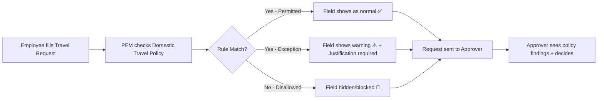

# 🌍 Travel & Expense Module – Domestic Travel Policy
### Explained in Simple Language with Examples

Hi! Let me break down this document for you in the simplest way possible, with real-life examples. 🎯

---

## 🔹 First: What is the Travel & Expense (T&E) Module?

Think of the **Travel & Expense module** as a digital rulebook + workflow system that helps companies manage:
- ✅ When employees can travel for work
- ✅ How they should book flights/hotels
- ✅ What they can spend on food, transport, etc.
- ✅ How they get reimbursed or receive advance money

> 💡 **Simple Analogy**: Imagine your company is like a school organizing a field trip. The T&E module is like the "trip rules sheet" that tells:
> - Who can go (teachers vs students)
> - Which bus to take (AC vs non-AC)
> - How much lunch money each gets
> - Who approves the trip

---

## 🔹 What is "Domestic Travel Policy"?

### 📌 Definition (in simple words):
> A **Domestic Travel Policy** is a pre-defined set of rules that answers:  
> *"If I'm an employee traveling for work within my home country, what am I allowed to do, book, and spend?"*

### 🎯 Why does a company need this?
| Without Policy ❌ | With Policy ✅ |
|------------------|---------------|
| Every trip = new discussion with manager | Rules are already set – just follow them |
| "Can I fly business class?" → Manager guesses | Policy says: "Grade 5+ can fly business" |
| Hard to track spending | Easy to audit & control costs |
| Employees confused about what to claim | Clear entitlements = less confusion |

---

## 🔹 What Does This Policy Actually Control? (With Examples)

Let's go rule-by-rule with a **real-life scenario**:

> 👤 **Meet Priya** – She's a Grade 3 employee (mid-level), based in Bangalore.  
> 🎯 **Trip Purpose**: Client meeting in Mumbai (domestic trip)  
> 📅 **Trip Dates**: 10th–12th June 2026 (3 days, 2 nights)

### 1️⃣ Trip Authorisation Rules
| Rule | What it means | Example for Priya |
|------|---------------|-------------------|
| **Minimum Lead Time** | How many days before travel must she submit request? | Policy says: "Submit at least 5 days before". If she submits on 8th June for 10th June trip → ⚠️ Exception flag |
| **Maximum Trip Duration** | Longest allowed trip under this policy | Policy says: "Max 14 days". Her 3-day trip ✅ OK |
| **Open Return Date** | Can she submit without fixed return date? | Policy says: "Not allowed for Grade 3". She must enter return date ✅ |

---

### 2️⃣ Booking Arrangement
| Rule | Meaning | Example |
|------|---------|---------|
| **Self Booking** | Can Priya book her own flight/hotel? | Policy: "Grade 1-3 must use Travel Desk". So Priya ❌ cannot self-book → system hides "Self" option |

---

### 3️⃣ Travel Mode & Class (How she travels)
| Rule | Meaning | Example for Priya |
|------|---------|-------------------|
| **Permitted Travel Mode** | Which transport can she use? | Policy: "Air, Rail, Road permitted for Grade 3" ✅ |
| **Permitted Travel Class** | Which class within that mode? | Policy: "Air: Economy=Permitted, Business=Exception". If Priya selects Business → ✍️ Must add justification |

> 💡 **Permission Levels Explained**:
> - 🟢 **Permitted** = Normal choice, no questions asked
> - 🟡 **Exception** = Allowed, but must justify + may need extra approval
> - 🔴 **Disallowed** = Hidden/blocked – cannot select

---

### 4️⃣ Accommodation (Where she stays)
| Rule | Meaning | Example |
|------|---------|---------|
| **Permitted Property Type** | Hotel, guest house, hosted, etc.? | Policy: "Hotel, Company Guest House = Permitted; Airbnb = Exception" |
| **Permitted Star Rating** | 3-star, 4-star, 5-star? | Policy: "Grade 3: Max 3-star in metro cities" |
| **Maximum Stay Rate** | Max ₹ per night reimbursable | Policy: "₹3,500/night for Mumbai". If hotel is ₹4,000 → ₹500 not reimbursed (unless approved as exception) |

---

### 5️⃣ Food Entitlement (What she eats)
> 🍽️ Two models – company picks ONE:

| Model | How it works | Example |
|-------|--------------|---------|
| **Daily Food Entitlement** | One flat amount per day for all meals | Policy: "₹800/day for Mumbai". Priya spends ₹300 breakfast + ₹400 lunch + ₹200 dinner = ₹900 → ₹100 not reimbursed |
| **Meal Caps** | Separate limits for breakfast/lunch/dinner | Policy: "Breakfast ₹200, Lunch ₹350, Dinner ₹250". If dinner bill is ₹300 → ₹50 not reimbursed |

> ⚠️ **Hosted Meal Deduction**: If client provides lunch, policy deducts that meal's value.  
> Example: Deduction rate = 0.33 (33%). If daily food entitlement = ₹800, and lunch is hosted → ₹800 × 0.33 = ₹264 deducted from claim.

---

### 6️⃣ Local Commute (Getting around at destination)
| Rule | Meaning | Example |
|------|---------|---------|
| **Permitted Commute Mode** | Cab, auto, public transport, own vehicle? | Policy: "App Cab, Public Transport = Permitted; Own Vehicle = Exception" |
| **Commute Ride Cap** | Max ₹ per cab ride | Policy: "₹400/ride in Mumbai". If cab fare = ₹550 → ₹150 not reimbursed |
| **Mileage Rate** | If using own vehicle, ₹ per km | Policy: "₹12/km for Grade 3". If Priya drives 30 km → 30 × ₹12 = ₹360 reimbursed |

---

### 7️⃣ Incidentals (Small extra expenses)
| Rule | Meaning | Example |
|------|---------|---------|
| **Permitted Incidental Types** | Which small expenses can be claimed? | Policy: "Porterage, Tips = Permitted; Laundry = Exception" |
| **Daily Incidentals Cap** | Max total for all incidentals per day | Policy: "₹200/day cap". If Priya claims ₹150 tips + ₹100 porterage = ₹250 → ₹50 not reimbursed |

---

### 8️⃣ Allowances (Extra daily money for being on trip)
| Day Type | When it applies | Example Amount |
|----------|----------------|----------------|
| **Day Trip Allowance** | Leave & return same day, no stay | ₹500 |
| **Stay Day Allowance** | Full day at destination (overnight) | ₹1,200/day |
| **Transit Day Allowance** | Travel day (departure/return) | ₹700/day |

> For Priya's 3-day trip:  
> - Day 1 (Transit): ₹700  
> - Day 2 (Stay): ₹1,200  
> - Day 3 (Transit): ₹700  
> ✅ Total allowance = ₹2,600 (added to claim automatically)

---

### 9️⃣ Travel Advance (Upfront cash for trip)
| Rule | Meaning | Example |
|------|---------|---------|
| **Travel Advances Enabled?** | Can employee request advance? | Policy: "Enabled for Grade 3" ✅ |
| **Maximum Advance Amount** | Fixed ceiling per trip | Policy: "₹15,000 max advance" |
| **Daily Advance Amount** | OR: ₹ per day × trip duration | Policy: "₹2,000/day × 3 days = ₹6,000" |

> ⚠️ Only ONE of the two advance rules is active at a time.

---

## 🔹 How Does This Work in the System? (Runtime Flow)



> 🧠 **PEM = Policy Evaluation Manager**  
> It's the "brain" that reads the policy + employee data + trip details → decides what's allowed.

---

## 🔹 Key Testing Points for You (QA Perspective) 🧪

Since you're testing this, here's what to focus on:

### ✅ Test Scenarios Checklist
| Scenario | What to Verify | Example Test Case |
|----------|---------------|-------------------|
| **Grade-based variation** | Same rule, different grades → different outcomes | Grade 1 vs Grade 5: Air travel class options differ |
| **Destination category** | Metro vs Tier-2 → different hotel caps | Mumbai (metro): ₹3,500/night vs Indore (tier-2): ₹2,000/night |
| **Trip purpose variation** | Client meeting vs training → different lead time | Client meeting: 3 days lead time; Training: 7 days |
| **Exception flow** | Select "Exception" option → justification field appears + workflow routes correctly | Priya selects Business class → system shows "Justify" box + routes to senior approver |
| **Currency mismatch** | Policy in INR, request in USD → rule skipped | PEM logs "Skipped: CurrencyMismatch" |
| **Alternative models** | Daily Food vs Meal Caps – only one active per employee group | Configure both → system should warn/block |
| **Advance calculation** | Daily Advance × Duration = correct ceiling | ₹2,000 × 3 days = ₹6,000 max advance |

### 🔍 UI Testing Tips
- Dropdowns should only show **Permitted** + **Exception** options (not Disallowed)
- **Exception** options should have visual indicator (e.g., ⚠️ icon or yellow highlight)
- Justification field should appear **only when Exception option is selected**
- Policy findings should be visible to approver in workflow UI

### 🌐 API Testing Tips (since you mentioned API testing)
```json
// Sample request payload snippet
{
  "employeeGrade": "3",
  "tripDestination": "Mumbai",
  "destinationCategory": "Metro",
  "travelMode": "Air",
  "travelClass": "Business",  // ← This should trigger Exception
  "hotelStarRating": "4",     // ← Should be blocked if policy allows max 3-star
  "foodModel": "Daily",       // ← Should not allow both Daily + Meal Caps
  "advanceRequested": 7000    // ← Should be ≤ policy ceiling
}
```

---

## 🔹 Quick Glossary (Simple Definitions)

| Term | Simple Meaning |
|------|---------------|
| **Base Location** | Where employee normally works (e.g., Bangalore office) |
| **Destination Category** | How expensive the city is: Metro (Mumbai), Tier-1 (Pune), Tier-2 (Nashik) |
| **CheckWhen Scenario** | "IF employee is Grade 3 AND destination is Metro → apply this rule" |
| **RuleGroup** | A bucket of related rules (e.g., all food-related rules) |
| **Deviation** | What happens if rule is broken: Allow (with flag), Disallow (block), or Disabled (ignore rule) |
| **TRN** | Travel Request Number – the actual trip request record in system |

---

## 🔹 One Real End-to-End Example 🎬

> 👤 **Rahul**, Grade 2, based in Delhi  
> 🎯 Trip: Training in Jaipur (Tier-1 city), 2 days, 1 night  
> 📅 Submitted request 4 days before travel

### System Evaluation:
1. ✅ Lead Time: Policy says min 3 days for training → 4 days ✅ OK  
2. ✅ Duration: 2 days < max 14 days ✅  
3. ❌ Self Booking: Policy says Grade 1-3 must use Travel Desk → "Self" option hidden  
4. ✅ Travel Mode: Rail permitted for Grade 2  
5. ✅ Travel Class: AC Chair Car = Permitted, AC 2-Tier = Exception  
6. ✅ Hotel: Max 3-star, ₹2,500/night for Tier-1  
7. ✅ Food: Daily entitlement ₹600/day  
8. ✅ Commute: App Cab permitted, ₹300/ride cap  
9. ✅ Allowance: Transit day ₹500 + Stay day ₹900 = ₹1,400 total  
10. ✅ Advance: Max ₹5,000 fixed ceiling  

### Result:
- Rahul sees only permitted options in dropdowns  
- If he tries AC 2-Tier → system shows ⚠️ + asks for justification  
- Approver sees: "Policy Check: 1 Exception (Travel Class), rest compliant"  
- After trip: Expense claim auto-validates against same policy rules

---

## 🔹 Summary: What You're Really Testing 🎯

You're verifying that:
1. ✅ **Policy rules are correctly configured** in Settings App  
2. ✅ **PEM evaluates rules accurately** based on employee + trip data  
3. ✅ **UI reflects policy outcomes** (dropdowns, warnings, hidden fields)  
4. ✅ **Workflow routes correctly** when exceptions occur  
5. ✅ **Expense claims re-validate** against the same policy  
6. ✅ **Variations work** (grade, destination, purpose) without conflicts  

> 💡 **Pro Tip for Testing**: Create a "Policy Test Matrix" spreadsheet:
> | Employee Grade | Destination | Trip Purpose | Expected Travel Class | Expected Hotel Cap | Expected Food Amount |
> |----------------|-------------|--------------|----------------------|-------------------|-------------------|
> | Grade 1 | Metro | Client | Economy | ₹2,000 | ₹500/day |
> | Grade 5 | Tier-2 | Training | Business | ₹4,000 | ₹1,000/day |

---

Let me know if you'd like:
- 🗂️ A sample test case template for this feature  
- 🧪 API payload examples for positive/negative scenarios  
- 🎨 A simple flowchart/diagram of the evaluation process  
- 🔍 Help mapping this to your Testsigma test cases  

Happy to help further! 😊
